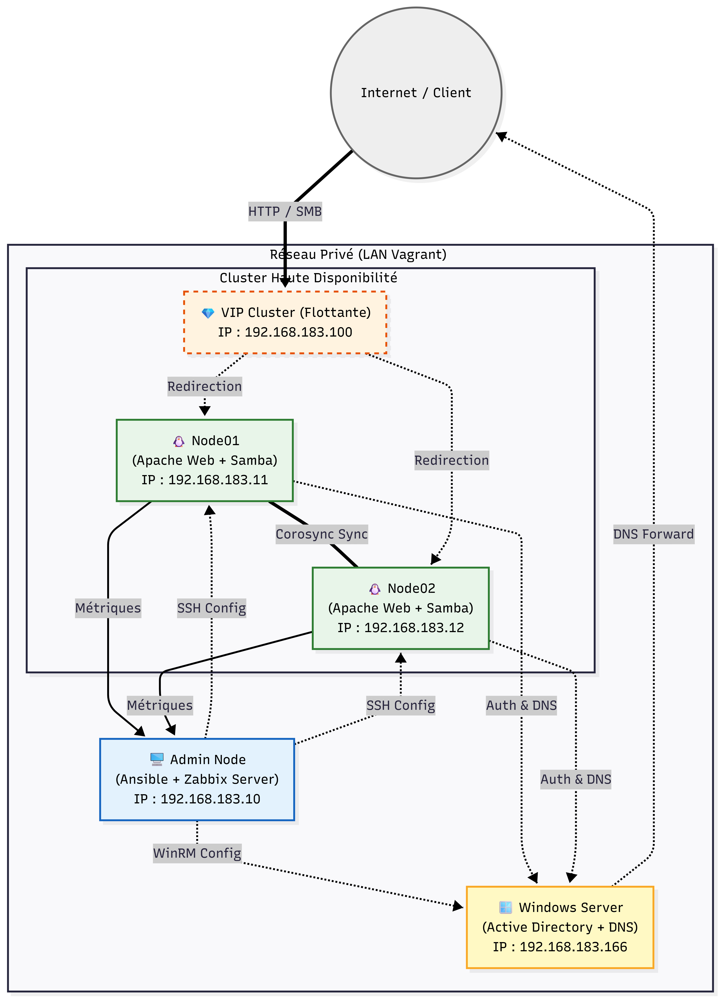
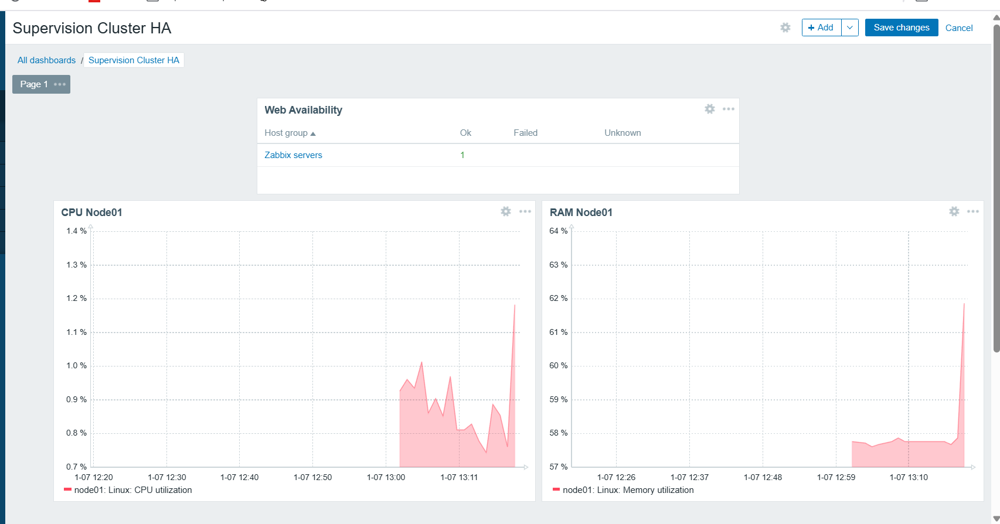

# Déploiement Automatisé d'une Infrastructure Haute Disponibilité & Sécurisée

Ce projet met en œuvre une infrastructure complète, résiliente et sécurisée pour une PME, en utilisant une approche **Infrastructure as Code (IaC)** et **DevOps**.
L'ensemble de l'environnement est déployé automatiquement via **Vagrant** et configuré via **Ansible**, incluant un cluster Haute Disponibilité (HA), un Contrôleur de Domaine Active Directory, et une supervision centralisée avec Zabbix.

## 🏗️ Architecture du Lab

L'infrastructure se compose de 4 machines virtuelles interconnectées :

| Machine    |          OS         |                    Rôle                   |          IP           |
| -----------| ------------------- | ----------------------------------------- | --------------------- |
| **Admin**  | Ubuntu 22.04        | Nœud de contrôle Ansible + Serveur Zabbix | `192.168.183.10`      |
| **Node01** | Rocky Linux 9       | Nœud Cluster HA (Web + Samba)             | `192.168.183.11`      |
| **Node02** | Rocky Linux 9       | Nœud Cluster HA (Web + Samba)             | `192.168.183.12`      |
| **WinSrv** | Windows Server 2022 | Active Directory (AD DS)                  | `192.168.183.166`     |
| **VIP**    | (Flottante)         | Adresse IP virtuelle du Cluster           | **`192.168.183.100`** |

### Schéma Logique



---

## 🚀 Installation et Démarrage

### Prérequis

* Un hyperviseur (VMware Workstation ou Fusion).
* Vagrant installé sur la machine hôte.
* Environ 8-10 Go de RAM disponibles.

### Procédure de déploiement

Le déploiement est **100% automatisé**. Une seule commande suffit pour monter l'infrastructure :

1. Cloner le dépôt :
```bash
git clone <votre-lien-repo>
cd <dossier-du-projet>

```


2. Lancer la construction :
```bash
vagrant up

```


> **Note :** Le provisionning Ansible se lance automatiquement depuis la machine `Admin` via le script `bootstrap.sh`. L'installation complète peut prendre 15 à 20 minutes (notamment pour l'Active Directory et la compilation Zabbix).

---

## 🛡️ Détails des Missions Réalisées

### Mission 1 : Haute Disponibilité (HA)

Mise en place d'un cluster actif/passif avec **Pacemaker** et **Corosync**.

* **VIP :** Une IP flottante (`.100`) bascule automatiquement en cas de panne.
* **Services :** Serveur Web (Apache) et Samba (Partage de fichiers) sont pilotés par le cluster.
* **Contraintes :** Colocation stricte configurée (L'IP, le Web et Samba migrent toujours ensemble).


### Mission 2 : Sécurisation Linux (Hardening)

Application des règles de sécurité via le playbook `security_linux.yml` :

* 🔒 Désactivation du SSH en `root`.
* 🧱 Pare-feu (Firewalld) configuré : seuls les ports SSH, HTTP, Cluster et Zabbix sont ouverts.
* 🔄 Mises à jour de sécurité automatiques activées (`dnf-automatic`).

### Mission 3 : Windows & Active Directory

Configuration complète via Ansible (WinRM) :

* Promotion du serveur en **Contrôleur de Domaine** (`mylab.local`).
* **Hardening Windows :**
* Désactivation de SMBv1 et LLMNR.
* Politique de mot de passe stricte (Min 12 caractères).
* Pare-feu activé sur tous les profils (Domain/Private/Public).
* Désactivation du compte Invité.


* **IP Fixe :** Script de maintien d'IP statique (`.166`) intégré au démarrage.

### Mission 4 : Supervision Zabbix

Déploiement complet de la stack de monitoring :

* **Serveur :** Installé sur la machine `Admin` (LAMP stack + Zabbix Server).
* **Agents :** Déployés automatiquement sur `Node01` et `Node02`.
* **Dashboard :** Tableau de bord personnalisé affichant :
* La disponibilité du site Web (via la VIP).
* L'utilisation CPU/RAM des nœuds.
* Les alertes en temps réel.





---

## 📂 Structure du projet

```
.
├── Vagrantfile             # Définition des VMs et réseaux
├── README.md               # Documentation
└── ansible/
    ├── hosts.ini           # Inventaire (Linux + Windows)
    ├── bootstrap.sh        # Script d'orchestration global
    ├── install_ha.yml      # Cluster Pacemaker/Corosync
    ├── deploy_web.yml      # Service Web
    ├── deploy_samba.yml    # Service Samba HA
    ├── security_linux.yml  # Hardening Linux
    ├── install_ad.yml      # Installation Active Directory
    ├── security_windows.yml# Hardening Windows
    ├── install_zabbix_agent.yml
    └── install_zabbix_server.yml

```

---

## 👤 Auteurs

* **Alexandre Ducret**

---
